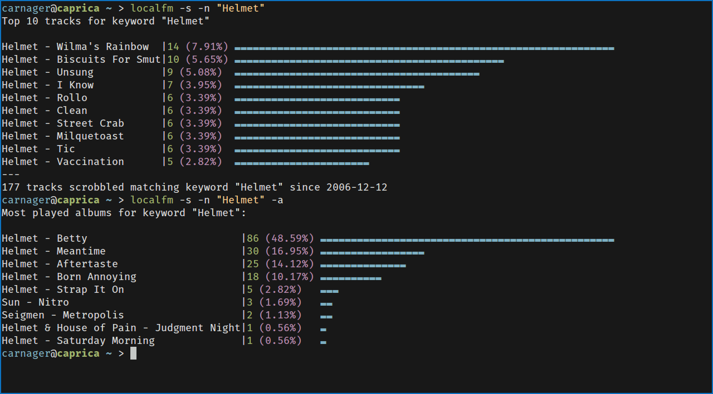

# local.fm

#### little script to generate stats from mpdscribble's local history


# Screenshot


# Features
* Generate Stats from mpdscribble log files
* Ability to use Rockbox .scrobbler files

# Dependencies

* awk
* [mpdscribble](http://git.musicpd.org/cgit/master/mpdscribble.git/)
* [distribution](https://github.com/philovivero/distribution)

# Config

Configuration consists of 2 options only.

```
mpdscribble="path/to/mpdscribble-log"
rockbox="/path/to/mounted/rockbox/device"
```

