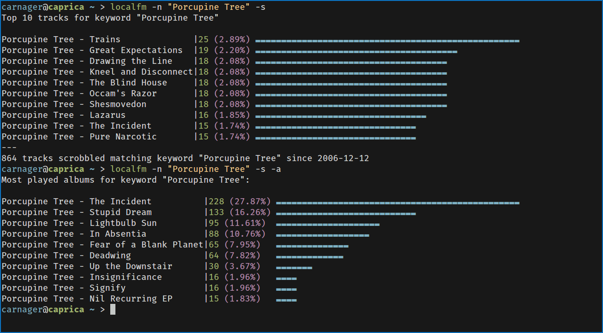

# local.fm

#### little script to generate stats from mpdscribble's local history

# Synopsis

Recently mpdscribble gained support to log to local files.
This script uses this file and creates most listened stats for keywords (album and track based)

It also allows to import rockbox' `.scrobbler` files and use these too for calculation.

# Dependencies

* awk
* [mpdscribble](http://git.musicpd.org/cgit/master/mpdscribble.git/)
* [distribution](https://github.com/philovivero/distribution)

# Config

Configuration consists of 2 options only.

```
mpdscribble="path/to/mpdscribble-log"
rockbox="/path/to/mounted/rockbox/device"
```


# Screenshot

